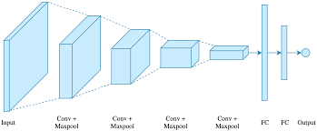
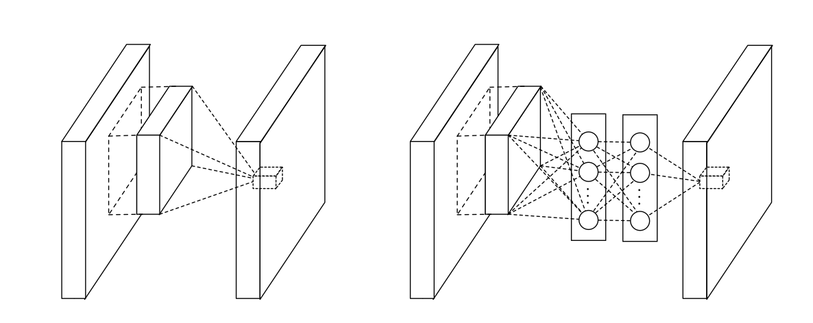
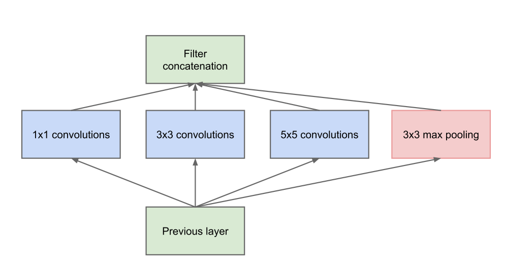
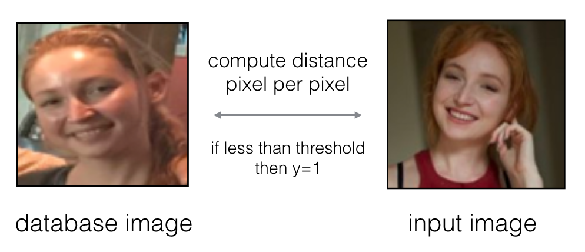
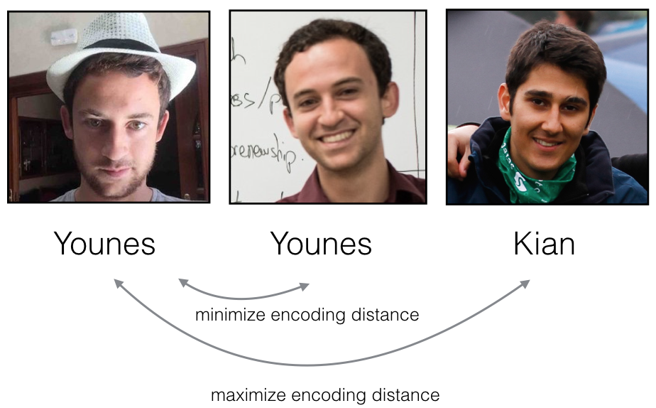
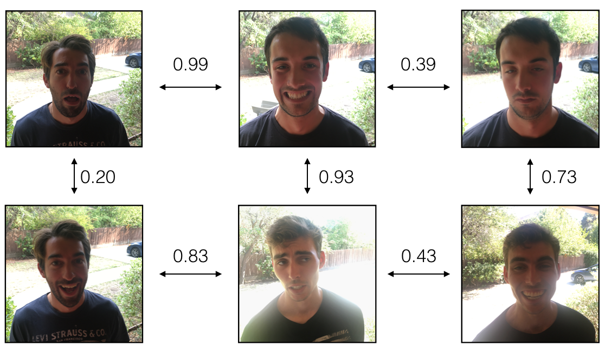

# Face Recognition

## Jupyter Demo

▶️ [Face Vrification | Face Recognition](https://nbviewer.jupyter.org/github/ashutosh1919/homemade-machine-learning/blob/master/notebooks/face_recognition/Face_Recognition.ipynb)- Recognize the person's name by his/her image if that person images are trained before.

## Definition

**Convolutional Neural Networks** (CNN) are very similar to ordinary Neural Networks from the previous chapter: they are made up of neurons that have learnable weights and biases. Each neuron receives some inputs, performs a dot product and optionally follows it with a non-linearity. The whole network still expresses a single differentiable score function: from the raw image pixels on one end to class scores at the other. And they still have a loss function (e.g. SVM/Softmax) on the last (fully-connected) layer and all the tips/tricks we developed for learning regular Neural Networks still apply.

ConvNet architectures make the explicit assumption that the inputs are images, which allows us to encode certain properties into the architecture. These then make the forward function more efficient to implement and vastly reduce the amount of parameters in the network.

## Layers used to build ConvNets

simple ConvNet is a sequence of layers, and every layer of a ConvNet transforms one volume of activations to another through a differentiable function. We use three main types of layers to build ConvNet architectures: Convolutional Layer, Pooling Layer, and Fully-Connected Layer (exactly as seen in regular Neural Networks). We will stack these layers to form a full ConvNet architecture.

Example Architecture: Overview. We will go into more details below, but a simple ConvNet for CIFAR-10 classification could have the architecture [INPUT - CONV - RELU - POOL - FC]. In more detail:

- INPUT [32x32x3] will hold the raw pixel values of the image, in this case an image of width 32, height 32, and with three color channels R,G,B.  
- CONV layer will compute the output of neurons that are connected to local regions in the input, each computing a dot product between their weights and a small region they are connected to in the input volume. This may result in volume such as [32x32x12] if we decided to use 12 filters.  
- RELU layer will apply an elementwise activation function, such as the max(0,x) thresholding at zero. This leaves the size of the volume unchanged ([32x32x12]).  
- POOL layer will perform a downsampling operation along the spatial dimensions (width, height), resulting in volume such as [16x16x12].  
- FC (i.e. fully-connected) layer will compute the class scores, resulting in volume of size [1x1x10], where each of the 10 numbers correspond to a class score, such as among the 10 categories of CIFAR-10. As with ordinary Neural Networks and as the name implies, each neuron in this layer will be connected to all the numbers in the previous volume.  

## Inception Networks

Inception is a technique originally used in LeNet, this was a successful convolutional neural network or CNN for identifying patterns in images. It was designed by Yann LeCun and his colleagues.
These types of networks are also called as Network inside Network.

In this technique, One layer of output is given to different types of filters as shown in these diagrams.
Each filter performs computations and results the output 3 dimensional block. All these blocks are concatenated and passed to next layer.

The advantage of Inception Network is that it can train model for different different filters. And different types of filters can extract differnt types of information. So, these type of network can extract more information than regular Convolutional Networks.

The disadvantage of Inception Network is that training process is very slow in comparison to ConvNets because each filter performs computations making model more computationally expensive.

Below diagram represents one Inception Layer in the Neural Network.

## Concept behind Image Comparisions

How can we compare two images to say whether they are of same person's or different one.

The basic formula is finding the embedding vector difference of normalized images and if the difference is less than the specific threshold, then they are of same person otherwise different.

At the time of training the model for the person's images, we take the embedding vector of the person's image and store it in the database with person's name. 
At the time of evaluation, when person inputs an image, model finds an embedding vector corresponding to the new image. Also, it takes all the embedding vectors in the database and computes the difference. As an output, it gives the name of person who's embedding vector difference is minimum and below threshold as given in below figure. Required Calculations are explained in details in Notebook.

## Triplet Loss

## Distance Comparisions

## References

- [Machine Learning on Coursera](https://www.coursera.org/learn/machine-learning)
- [Convolutional Neural Networks with Keras](https://www.kaggle.com/moghazy/guide-to-cnns-with-data-augmentation-keras)
- [Neural Network on Wikipedia](https://en.wikipedia.org/wiki/Artificial_neural_network)
- [TensorFlow Neural Network Playground](https://playground.tensorflow.org/)
- [Deep Learning by deeplearning.ai](https://www.deeplearning.ai/)
